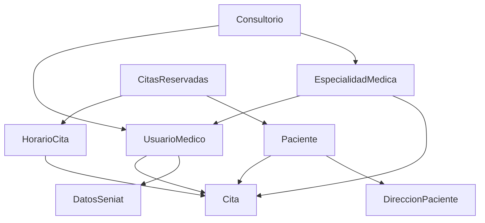

# System Patterns & Architecture: Unidad Médica

## Architectural Overview

### Core Architecture Pattern
**Layered Architecture**: Clean separation between presentation, business logic, and data layers

```
┌─────────────────────────────────────────┐
│           Presentation Layer            │
│   Templates, Static Files, JavaScript   │
├─────────────────────────────────────────┤
│           Business Logic Layer          │
│   Views, Forms, Services, Managers      │
├─────────────────────────────────────────┤
│           Data Access Layer             │
│   Models, QuerySets, Managers           │
├─────────────────────────────────────────┤
│           External Services             │
│   Google Calendar, SMS, Email Service   │
└─────────────────────────────────────────┘
```

### Django App Structure Pattern
**Modular App Organization**: Clear separation of concerns across Django apps

```
unidad_medica/
├── web/              # Public website and marketing pages
├── citas/            # Core appointment management system
├── core/             # Shared utilities and base functionality
└── api/              # REST API endpoints
```

## Key Technical Decisions

### 1. Appointment Scheduling Pattern
**Time-Slot Based Availability**: Doctors define availability blocks, system generates discrete appointment slots

```python
# Availability block: 9:00 AM - 12:00 PM
# Generated slots: 9:00, 9:30, 10:00, 10:30, 11:00, 11:30
# Each slot represents one 30-minute consultation
```

**Conflict Prevention**: Database constraints ensure no double-booking
```python
class Meta:
    unique_together = ('horario', 'start_datetime', 'end_datetime')
```

### 2. Geographic Hierarchy Pattern
**Nested Administrative Divisions**: Venezuelan geographic structure with cascading selections

```
País (Country)
├── Estado (State)
    ├── Ciudad (City)
        ├── Municipio (Municipality)
            └── Parroquia (Parish)
```

**Performance Optimization**: Indexed foreign key relationships prevent N+1 queries

### 3. Medical Registry Integration Pattern
**Dual Registration System**: Internal Django users linked to external medical registries

```python
class UsuarioMedico(models.Model):
    # Internal fields (managed=True)
    user = models.OneToOneField(User, on_delete=models.CASCADE)
    telefono = models.CharField(max_length=20)
    
    # External registry fields (managed=False)
    Registro_MPPS = models.CharField(max_length=30, db_column='Registro_MPPS')
    Numero_Colegio_de_Medico = models.CharField(max_length=50)
```

## Component Relationships

### Core Entities & Relationships



**Key Relationships Explained:**
- **Paciente → Cita**: One-to-many (patients can have multiple appointments)
- **UsuarioMedico → Cita**: One-to-many (doctors can have multiple appointments)
- **EspecialidadMedica → UsuarioMedico**: Many-to-many through MedicoEspecialidad
- **HorarioCita → CitasReservadas**: One-to-many (availability slots to booked appointments)

### Business Logic Patterns

#### 1. Appointment Booking Flow
```python
def book_appointment(patient, doctor, specialty, datetime):
    """
    Pattern: Validate → Reserve → Confirm → Sync
    """
    # 1. Check availability
    slot = HorarioCita.objects.get_available_slot(doctor, specialty, datetime)
    
    # 2. Create reservation (pessimistic locking)
    with transaction.atomic():
        reservation = CitasReservadas.objects.create(
            horario=slot,
            paciente=patient,
            start_datetime=datetime,
            end_datetime=datetime + timedelta(minutes=30)
        )
    
    # 3. Sync with Google Calendar
    google_calendar_service.create_event(reservation)
    
    # 4. Send confirmation notifications
    send_booking_confirmation(reservation)
```

#### 2. Doctor Availability Management
```python
def create_availability_schedule(doctor, specialty, start_date, end_date, time_slots):
    """
    Pattern: Recurring Schedule Generation
    """
    availability_blocks = []
    
    for single_date in date_range(start_date, end_date):
        if is_working_day(single_date):  # Skip weekends/holidays
            for time_slot in time_slots:
                block = HorarioCita.objects.create(
                    medico=doctor,
                    especialidad=specialty,
                    start_datetime=datetime.combine(single_date, time_slot['start']),
                    end_datetime=datetime.combine(single_date, time_slot['end']),
                    recurrence_rule=generate_recurrence_rule(single_date, end_date)
                )
                availability_blocks.append(block)
    
    return availability_blocks
```

## Data Flow Patterns

### 1. Patient Registration Flow
```
Patient Form → Validation → Geolocation Lookup → User Creation → Profile Completion
```

### 2. Appointment Management Flow
```
Availability Check → Slot Selection → Patient Assignment → Calendar Sync → Notification
```

### 3. Doctor Onboarding Flow
```
Personal Info → License Validation → Specialty Assignment → Schedule Creation → Calendar Sync
```

## Design Patterns in Use

### Repository Pattern (Django ORM)
```python
class PacienteRepository:
    @staticmethod
    def get_patients_by_specialty(especialidad, date_range):
        return Paciente.objects.filter(
            citas_paciente__especialidad=especialidad,
            citas_paciente__fecha_hora__range=date_range
        ).distinct()

# Usage
patients = PacienteRepository.get_patients_by_specialty(cardiology, last_month)
```

### Service Layer Pattern
```python
class AppointmentService:
    @staticmethod
    def create_appointment(patient_id, doctor_id, specialty_id, datetime):
        # Business logic coordination
        patient = Patient.objects.get(id=patient_id)
        doctor = UsuarioMedico.objects.get(id=doctor_id)
        
        # Validation logic
        AppointmentService.validate_availability(doctor, specialty_id, datetime)
        AppointmentService.check_patient_eligibility(patient)
        
        # Creation logic
        appointment = Cita.objects.create(
            paciente=patient,
            medico=doctor,
            # ... other fields
        )
        
        return appointment
```

### Factory Pattern for External Services
```python
class CalendarServiceFactory:
    @staticmethod
    def get_service(provider='google'):
        if provider == 'google':
            return GoogleCalendarService()
        elif provider == 'outlook':
            return OutlookCalendarService()
        else:
            raise ValueError(f"Unsupported calendar provider: {provider}")

# Usage
calendar_service = CalendarServiceFactory.get_service('google')
calendar_service.sync_appointment(appointment)
```

## System Constraints & Design Decisions

### Concurrency Handling
- **Pessimistic Locking**: Database transactions prevent race conditions during booking
- **Optimistic Locking**: Version fields for conflict detection in updates
- **Queue Processing**: Celery tasks for non-critical operations

### Data Integrity Patterns
- **Foreign Key Constraints**: Database-level referential integrity
- **Unique Constraints**: Prevent duplicate appointments and registrations
- **Check Constraints**: Business rule validation at database level

### Caching Strategy
- **Redis Caching**: Session data, frequently accessed doctor lists
- **Query Result Caching**: Complex geographic queries
- **Template Fragment Caching**: Static page components

## Integration Patterns

### Google Calendar Integration
```python
class GoogleCalendarService:
    def __init__(self):
        self.service = self._authenticate()
    
    def create_appointment_event(self, appointment):
        event = {
            'summary': f'Cita médica - {appointment.paciente}',
            'start': {'dateTime': appointment.fecha_hora.isoformat()},
            'end': {'dateTime': (appointment.fecha_hora + timedelta(minutes=appointment.duracion)).isoformat()},
            'attendees': [appointment.paciente.email,
